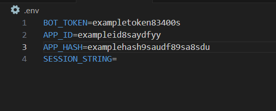

# Телеграм бот для сбора статистики о каналах
Бот, способный собирать информацию о публичных и закрытых телеграм каналах, с использованием Telegram Bot API, Telegram API и фреймворком Telegraf.js
## Развёртывание
Для установки
1. клонируйте проект: `git clone https://github.com/Magomed-R/statistic-bot.git`
2. установите зависимости: `npm i` или `pnpm i`
3. установите typescript если вы этого ещё не сделали: `npm i -g typescript`
4. скомпилируйте проект командой `tsc`
5. создайте файл .env в директории рядом с файлом package.json
6. перейдите на https://t.me/botfather, создайте нового бота и получите его токен 
7. перейдите на https://my.telegram.org/, создайте новое приложение (API development tools) и получите api_id и api_hash
8. вставьте все полученные данные в .env-файл следующим образом 
9. запустите консоль, перейдите в директорию проекта, запустите команду `npm run getSS` или `pnpm getSS` и поочерёдно вводите свои номер телефона, пароль, пришедший в телеграмме, и, если есть, пароль от двойной аутентификации
10. если всё прошло успешно, скопируйте последнюю строку и вставьте в SESSION_STRING в .env-файле
11. введите в консоли команду `npm start` или `pnpm start` для запуска бота
12. перейдите к боту и начните просмотр статистики!
