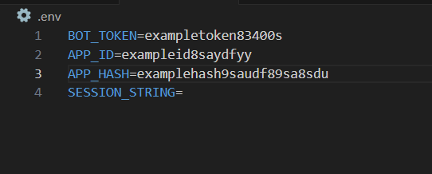

# Телеграм бот для сбора статистики о каналах
Бот, способный собирать информацию о публичных каналах без добавления в канал
## Развёртывание
Для установки
1. клонируйте проект: `git clone https://github.com/Magomed-R/statistic-bot.git`
2. установите зависимости: `npm i` или `pnpm i`
3. создайте файл .env в директории рядом с файлом package.json
4. перейдите на https://t.me/botfather, создайте нового бота и получите его токен 
5. перейдите на https://my.telegram.org/, создайте новое приложение (API development tools) и получите api_id и api_hash
6. вставьте все полученные данные в .env-файл следующим образом 
7. запустите консоль, перейдите в директорию проекта, запустите команду `npm run getSS` или `pnpm getSS` и поочерёдно вводите свои номер телефона, пароль, пришедший в телеграмме, и, если есть, пароль от двойной аутентификации
8. если всё прошло успешно, скопируйте последнюю строку и вставьте в SESSION_STRING в .env-файле
9. Введите в консоли команду `npm start` или `pnpm start`
